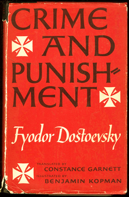
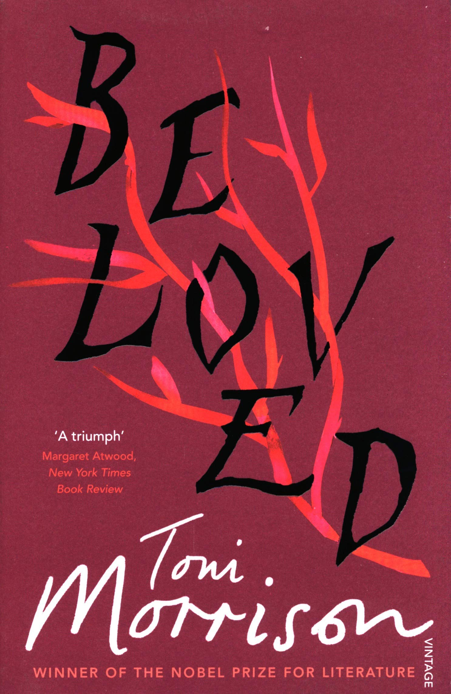
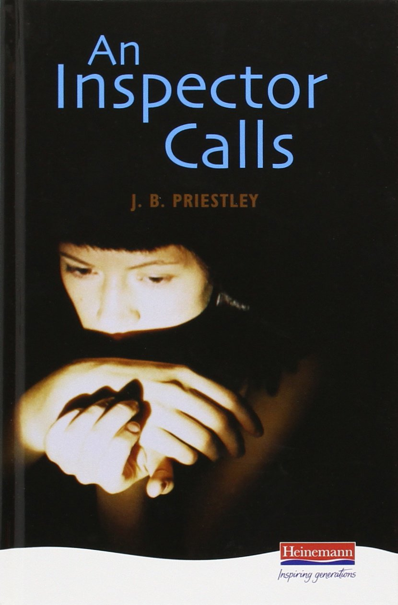

# Web-Design-Development
I have created a website for a book store that asks the user to purchase a book and enter in their card details. My program checks their details against the regular expressions that I needed to implement for the transaction to be successful, if the user's details are valid, then the program will encrypt it and add their information to my database.

COURSEWORK

BOOK WORLD

JASON YE 

Contents
Section A: Directory structure	3
Section B: Frontend	3
Index.php	4
Pay.php	5
Success.php	5
Correct details:	5
Wrong details:	6
Section C: Backend.	7
Section D: Code appendix	8
Index.php	8
Index.css	11
Pay.js	14
Pay.php	15
Success.php	16
Section E: Usability and accessibility checklist	18
Usability	18
Accessibility	18
References	19

 
Section A: Directory structure 
In this directory structure, I have created multiple different files such as index.css, index.php, pay.php, pay.js, success.php and an image folder. Inside the images folder I have downloaded a couple of JPEGs/PNGs that I have implemented into my website. These are all stored inside the XAMPP file, which allows me to connect to my web server.
Section B: Frontend 
Index.php
 

 

Pay.php
 
Success.php
Correct details:
  

 

Wrong details:
Card number
 

Expiration date
 
Security number
 

Section C: Backend. 
  
Section D: Code appendix 
Index.php
<!DOCTYPE html>
<html lang ="en">
	<head>
		<meta charset=utf-8 />
		<link rel="stylesheet" type="text/css" href="index.css">
		<title>Book World</title>
	</head>
	
	<header id="homeBanner">
		
		<h1>Book World</h1>
	</header>
	
	<nav>
		<ul>
			<li><a href="index.php" title="Home page for Book World">Home</a></li>
			<li><a href="#"  title="A page about Book World">About us</a></li>
			<li><a href="#"  title="Book World's contact page">Contact Us</a>
		</ul>
	</nav>
		
	<body>
		<table width="105%">
		<tr><td>
		
		<section id="book1" class="bookItems">
		<h3 class="title">The Great Gatsby</h3>
		
			<article id="book1Summ" class="bookArticles">
				<ul class="bookSummary">
					
Set in Jazz Age New York, the novel tells the <em>tragic story</em> of <strong> Jay Gatsby</strong>, a self-made millionaire, and his pursuit of Daisy Buchanan, a wealthy young woman whom he <em>loved</em> in his youth.

				</ul>
				<button id="btn1" onclick="payScreen()" class="payButtons">Pay</button>
				</article>
		</section>
		</td>
		
		<td><section id="book2" class="bookItems">
		<h3 class="title">Crime and Punishment</h3>
		
			<article id="book2Summ" class="bookArticles">
				<ul class="bookSummary">
					
Crime and Punishment focuses on the <strong>mental anguish</strong> and <em>moral dilemmas</em> of Rodion Raskolnikov, an impoverished ex-student in Saint Petersburg who formulates a plan to <strong>kill</strong> an unscrupulous pawnbroker for her money.

				</ul>
				<button id="btn2" onclick="payScreen()" class="payButtons">Pay</button>
				</article>
				</td></tr>
	
				
		<tr><td><section id="book3" class="bookItems">
		<h3 class="title">Beloved</h3>
		
			<article id="book3Summ" class="bookArticles">
				<ul class="bookSummary">
					
Beloved explores the physical, emotional, and spiritual devastation wrought by <strong>slavery</strong>, a devastation that continues to haunt those characters who are former slaves even in <em>freedom.</em>

				</ul>
				<button id="btn3" onclick="payScreen()" class="payButtons">Pay</button>
				</article>
		</td>	
		
		<td><section id="book4" class="bookItems">
		<h3 class="title">An Inspector Calls</h3>
		
			<article id="book4Summ" class="bookArticles">
				<ul class="bookSummary">
					
An Inspector Calls by J B Priestley, is a play that revolves around the <em>apparent <strong>suicide</strong></em> of a young woman called Eva Smith. In the play, the unsuspecting Birling family are visited by the mysterious Inspector Goole. He arrives just as they are celebrating the engagement of Sheila Birling to Gerald Croft.

				</ul>
				<button id="btn4" onclick="payScreen()" class="payButtons">Pay</button>
				</article>
		</section>
		</td></tr>
		
		
		
	</body>
	
	<footer>
	
	</footer>
</html>
Index.css
@charset "UTF-8";

html, body, div, section, article, aside, header, footer, nav, h1, h2, h3, h4, h5, h6, p, em, strong, img, ol, ul, li {
	margin: 0;
	padding: 0;
	border: 0;
}

html {
	background: #FFA500;
}

body {
	font-family: Arial, Helvetica, sans-serif;
	margin: 0 auto;
	width: 1000px;
	background: #FFFFFF;
	padding: 50px;

}

.logo{
	float: left;

}

#homeBanner h1{
	color:	#FF7F50;
	font-size: 3em;
	padding-left:350px;
	padding-top:20px;
}

nav{
	font-size: 1.15em;
	padding-top:60px;
	padding-left:310px;
}

.home{
	padding-right:50px;
}

.about{
	padding-right:50px;
}

.bookImages{
	width:30%;
	height:auto;
}

li {
	display: inline;
	padding-right:70px;
}

.title{
	padding-bottom:10px;
}

.bookItems{
	width:500px;
	margin-top:100px;
	margin-bottom:100px;
	
	

}
.bookArticles{
	margin-left:180px;
	font-size:17px;
	
}

.payButtons{
		margin-top:50px;
		margin-left:120px;
		border-radius:12px;
		padding:10px;
		padding-left:15px;
		padding-right:15px;
		background-color:#FF7F50;
		color:white;
		border:none;
		font-weight:bold;
}

input[type=submit]{
	padding:10px;
		padding-left:15px;
		padding-right:15px;
		border-radius:12px;
		background-color:#FF7F50;
		color:white;
		border:none;
		font-weight:bold;
		margin-top:-10px;
}

#btn4{
	margin-top:30px;
}

#btn3{
	margin-top:80px;
}

#btn1{
	margin-top:60px;
	
}

#payLogo{
	width:6%;
	height:auto;
	padding-right:800px;
}

#paymentTitle{
	border-bottom:2px solid #FF7F50;
}

#payOpt{
	padding-top:40px;
}

ul p{
	padding-top:10px;
}

#cardDetails{
	padding-top:50px;
	size=3;
}

Pay.js
function pay(){
	if((check_ccNum()==true)&&
	(check_expDate()==true) &&
	(check_cvv()==true)){ 
		return true;
	}
	else{
		return false;
	}
}

		
		
function check_ccNum(){
	let ccNum = document.getElementById("ccNum").value;
	const patt = /^(?:5[1-5][0-9]{14})$/;
	if(ccNum.match(patt)) return true;
	else alert("Incorrect Credit card number.");
	return false;
	}
		
		
function check_expDate(){
	let month = document.getElementById("expMonth").value;
	let year = document.getElementById("expYear").value;
					
	let expiryDate = new Date();
	let today = new Date();
					
	expiryDate.setFullYear(year, month-1);
					
	const patt1 = /^(?:[0-9]{1,2})$/;
	const patt2 = /^(?:[0-9]{4})$/;
					
	if(expiryDate > today)  return true;
	else alert("Your card has expired.");
	return false;
		}
		
		
function check_cvv(){
	let secCode = document.getElementById("secCode").value;
	const patt = /^(?:[0-9]{3,4})$/;
	if(secCode.match(patt))  return true;
	else alert("Wrong CVV.");
	return false;
	}

Pay.php
<!DOCTYPE html>
<html lang ="en">
	<head>
		<meta charset=utf-8 />
		<link rel="stylesheet" type="text/css" href="index.css">
		<title>Book World</title>
	</head>
	
	<header id="homeBanner">
		
		<h1>Book World</h1>
	</header>
	
	<nav>
		<ul>
			<li><a href="index.php">Home</a></li>
			<li><a href="#" >About us</a></li>
			<li><a href="#" >Contact Us</a>
		</ul>
	</nav>	
	<body>
		<section id="paySect">
			<h3 id="paymentTitle">Payment Options</h3>
					<article id="payOpt">
						Debit/Visa Card    
						
						<form onsubmit="return pay()" action="success.php" method="POST">
						
							<label>Card Number:</label> <input type="number" placeholder="xxxx xxxx xxxx xxxx" id="ccNum" name="ccNum" style="width:10em"/>  
							
							Expiration date:<input type="number" id="expMonth" placeholder="Month" name="expMonth" style="width:4em"/>
							<input type="number" id="expYear" placeholder="Year" name="expYear" style="width:4em">  
						
							Security Number: <input type="number" placeholder="xxx(x)" id="secCode" name="secCode" style="width:4em"/>   
							
							<input type="submit" value="Continue" id="sumbitBtn"/>
			
						</form>
					</article>
		</section>
		
		
	</body>
	
	<footer>
	
	</footer>
</html>

Success.php
<!DOCTYPE html>
<html lang ="en">
	<head>
		<meta charset=utf-8 />
		<link rel="stylesheet" type="text/css" href="index.css">
		<title>Book World</title>
	</head>
	
	<header id="homeBanner">
		
		<h1>Book World</h1>
	</header>
	
	<nav>
		<ul>
			<li><a href="index.php">Home</a></li>
			<li><a href="#" >About us</a></li>
			<li><a href="#" >Contact Us</a>
		</ul>
	</nav>	
	<body>
		<section id="successSection">
			<h3 id="paymentTitle">Overview</h3>
					<article id="payOpt">
					Debit/Visa Card    
						
						<form action="pay.php" method="POST">
							<?php
									$con = mysqli_connect("localhost","root","", "creditcard");
										if (!$con) {
											die ("Failed");
										}
										
									$m = $_POST["expMonth"];
									$y = $_POST["expYear"];
									$z = new dateTime();
									$z->setDate($y, $m, 1);
									$z->modify('+1 month -1 day');
									
									
									$ccNum = md5($_POST['ccNum']);
									$expDate = $z->format('yy-m-d');
									$ccv = $_POST["secCode"];
									
									$ccNumRAW=($_POST['ccNum']);
									$last4=substr($ccNumRAW, -4);
							
									//insert a record
									$sql = "INSERT INTO `card`(`ccnum`, `expdate`, `seccode`)
										VALUES ('$ccNum','$expDate','$ccv')";
									
									if ($con->query($sql)) {
											echo ("Payment Successful! Your credit card number ends in **** **** **** ".$last4);
										} 
										else {
											echo ("error");
										}
							?>
						</form>
					</article>
		</section>
		
		
	</body>
	
	<footer>
	
	</footer>
	
</html>

Section E: Usability and accessibility checklist 
Usability
Book World has been designed with a lot of thought put into it to achieve a great amount of usability for my audience. I have ensured that my website would contain a professional look so that it would be more approachable for the users since an unprofessional website will seem inadequate and untrustworthy. It has a clear structure as there is a header and body tag involved inside the code which will allow the users to guide themselves easily through each page within the website. I have also made use of the headings tag to ensure that each heading will fit in its own rightful place, for example the company name has a heading of H1 which shows its level of importance. My colour scheme involves a simple combination of white, orange, and black. I decided to only use 3 colours so that it would be easier for the user to navigate through the pages as it will be easier to read. I have labelled my website with headings, sub-titles, links, and description summaries so that the users can search for what they are looking for much easily. For example, the description of each book has been positioned to the right of the book covers’ image which allows the user to intuitively know which book it belongs to therefore improving my website’s layout and readability resulting in a professional look that will strengthen its authority and trust. My page navigations are purposely centred at the top of the page so that the users will be able to immediately see how they can navigate through my website, these are included in every page so that it’ll maintain a consistent design within the website therefore reducing complexity for the users.
Accessibility
The accessibility of my website has been thought about thoroughly, so that it can be accessible by all types of people whether that be people who may have poor vision, hearing, memory impairments or learning disabilities. In order to tackle all those issues, I have added in several different implementation into my website. I have declared the language of my page by adding in a html tag at the top of my page to show that it is written in English: <html lang ="en">. Title  “<title>” tags has also been included in my code so that screen readers will announce the titles that they are clicking on to the user therefore helping the users to navigate themselves across Book World. I have used heading levels to define information hierarchy by correctly assigning each tag to where they belong, for example I have given the title “Book World” H1 as that is the company’s name. Screen readers will also be able to immerse themselves into the website and gaining the same experience as everyone when reading the book descriptions because with the use of <em> and <strong> tags, the screen reader will read it out in a different tone therefore selling the book in an exciting way. Furthermore, I have added in title attribute to links so that it will provide the users with more information when they get redirected on to a different page. I have included lists for the navigation menu so that they’re all grouped together therefore making it easy to use. I have used Arial, Helvetica, sans-serif for my fonts. Sticking with a few fonts will make it more comfortable for the users to read as it may cause confusion and make it look unprofessional. I have decided to use a maximum of 3 colours for my website as having too many colours will affect how my website will look for people who are colour blind.

References
Figure 1: F.Scott Fitzgerald. (1925). The Great Gatsby. Available at: https://www.amazon.com/Great-Gatsby-F-Scott-Fitzgerald/dp/0743273567 (Accessed 19 February 2021). 
Figure 2: Fyodor Dostoyevsky. (1866). Crime and Punishment. Available at: https://en.wikipedia.org/wiki/Crime_and_Punishment (Accessed 19 February 2021).
Figure 3: Toni Morrison. (1987). Beloved. Available at: https://www.amazon.co.uk/Beloved-Toni-Morrison/dp/0099760118 (Accessed 19 February 2021).
Figure 4: J. B. Priestly. (1945). An Inspector Calls. Available at: https://www.amazon.co.uk/Inspector-Calls-Heinemann-Plays-14-16/dp/0435232827 (Accessed 19 February 2021).
Figure 5: Vector. (2018). Books Flat Icon Vector. Available at: https://commons.wikimedia.org/wiki/File:Books_Flat_Icon_Vector.svg (Accessed 19 February 2021).
Figure 6: Visa, Inc. (2015). Visa. Available at: https://commons.wikimedia.org/wiki/File:Visa.svg (Accessed 19 February 2021).
